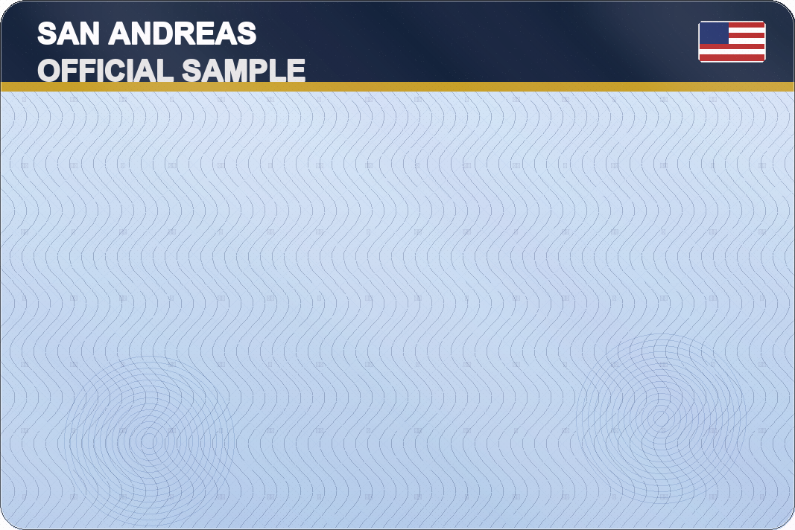

# PDCOMP ID Card Template Generator

Author: Aniki - Punch prod

PDCOMP ID Card Template Generator is a Python desktop tool built to quickly create ID card templates for PDCOMP.

It was made as a personal utility to generate cards faster, but if it helps other people build cards quickly, even better.

## Quick Access

- Windows executable: `dist/PDCOMP_ID_Card_Template_Generator_v1.0.0.exe`
- Source file: `gui_id_maker.py`

## Sample Output



## What This Tool Does

This application lets you generate visual ID card templates through a simple GUI.

You can use it to create:

- civil ID cards
- police cards
- FIB agent cards
- EMS cards
- military cards

You can also customize:

- the territory, state, or country name
- the official card name
- the flag shown on the card
- the imported seal, logo, or watermark
- the two main card colors
- the card layout
- the application language

## Features

- Free text territory or state input
- Custom official card subtitle
- Manual or automatic flag selection
- Large built-in flag selection
- Importable seal, logo, or watermark
- Button to remove a selected seal
- Two editable main colors
- 6 different layout styles
- Preview window before final export
- PNG export
- Multi-language interface: FR, EN, DE, ES

## Requirements

### Run from Python source

- Windows
- Python 3
- Pillow

### Run from Windows .exe

- Windows
- No Python installation required
- No Pillow installation required

## Project Files

- `gui_id_maker.py` - main application
- `icon.ico` - project icon
- `README.md` - documentation
- `LICENSE` - usage restrictions

## Installation Tutorial

### Run from Python source

#### 1. Install Python

Install Python 3 on your machine if it is not already installed.

#### 2. Install the dependency

Open a terminal in the project folder and run:

```bash
pip install pillow
```

#### 3. Start the application

Run the script with:

```bash
python gui_id_maker.py
```

### Run from Windows .exe

If you use the packaged Windows executable, you do not need to install Python or Pillow.

Launch:

```text
dist/PDCOMP_ID_Card_Template_Generator_v1.0.0.exe
```

### No dependencies required for the .exe

The `.exe` version is packaged with PyInstaller and is intended to run as a standalone application on Windows.

## How To Use

### 1. Choose the interface language

At the top of the window, select one of the available interface languages:

- FR
- EN
- DE
- ES

### 2. Enter a territory or state

Use the Territory / Country field to:

- select one of the predefined entries
- or type your own custom territory or country name

### 3. Choose a flag

Use the Flag field to:

- keep `AUTO` to follow the selected territory when available
- or manually choose a flag from the built-in list

### 4. Enter an official card name

Use the optional Card Name field to replace the default subtitle shown under the main title on the card.

### 5. Select a card type

You can generate these card categories:

- Civil Card / Civil Status
- Police (Law Enforcement / Badge)
- FIB (Federal Agent)
- EMS (Medical Services)
- Military

### 6. Pick a layout

Choose one of the 6 available layout styles to change how the title block and safe zone are arranged.

### 7. Customize colors

Enable custom colors if you want to override the default theme colors.

You can edit:

- the header color
- the stripe color

### 8. Add a seal or watermark

Use the Browse button to import a PNG or JPG file.

If you want to remove it later, click the Clear button to generate the next card without any seal.

### 9. Preview the card

Click the Preview button to open a preview window before saving the final result.

### 10. Export the final card

Click the Print button and choose where to save the final PNG file.

## Export To .exe

If you want to build a Windows executable, install PyInstaller:

```bash
pip install pyinstaller
```

Then run:

```bash
pyinstaller --noconsole --onefile --icon icon.ico gui_id_maker.py
```

The generated executable will be created in the `dist` folder.

## Notes

- The app exports visual card templates in PNG format.
- Some complex flags are simplified so they remain readable in a small badge area.
- The final visual result may depend on font availability on Windows.

## Usage Rights

This project is not allowed to be sold or redistributed without permission.

See [LICENSE](LICENSE) for the full usage terms.
